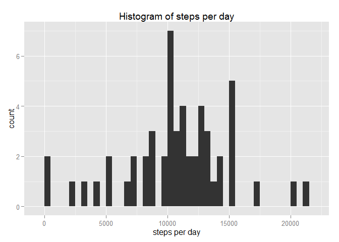
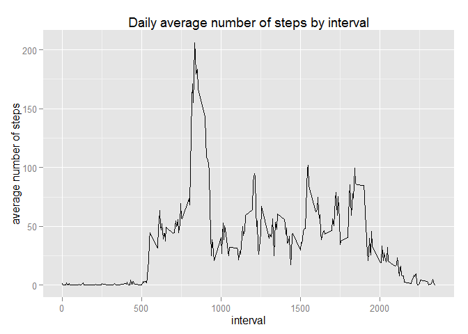
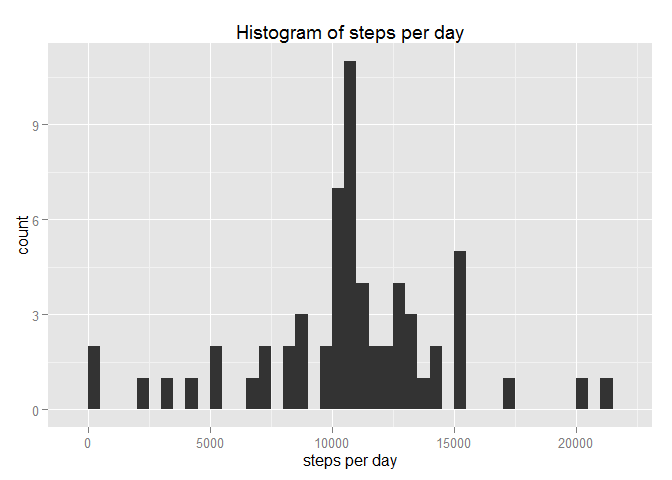
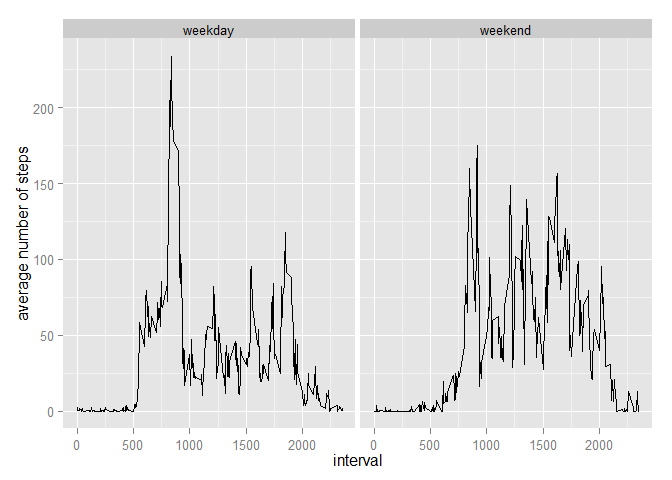

# Reproducible Research: Peer Assessment 1


## Loading and preprocessing the data

The dataset is loaded and the date column is transformed to the corresponding class:

```r
act <- read.csv("activity.csv", stringsAsFactors=F)
act$date <- as.Date(act$date)
str(act)
```

```
## 'data.frame':	17568 obs. of  3 variables:
##  $ steps   : int  NA NA NA NA NA NA NA NA NA NA ...
##  $ date    : Date, format: "2012-10-01" "2012-10-01" ...
##  $ interval: int  0 5 10 15 20 25 30 35 40 45 ...
```

## What is mean total number of steps taken per day?

1. The data is first grouped by date to aggregate the steps to totals per day. Then, a histogram for the totals is plotted.


```r
library(ggplot2)
```

```
## Warning: package 'ggplot2' was built under R version 3.1.1
```

```r
actByDay <- aggregate(act$steps, 
                          by=list(act$date), FUN=sum)
qplot(actByDay$x, binwidth=500, 
      xlab="steps per day", main="Histogram of steps per day")
```

 

2. The mean and median of the total number of steps per day are calculated in the following way:

```r
mean <- mean(actByDay$x, na.rm=T)
mean
```

```
## [1] 10766
```

```r
median <- median(actByDay$x, na.rm=T)
median
```

```
## [1] 10765
```
The mean total number of steps taken per day is 1.0766 &times; 10<sup>4</sup>.

## What is the average daily activity pattern?

1. In order to show the time series chart, average steps per interval are calculated ignoring NA-values. The plot looks like this:

```r
actByInt <- aggregate(act$steps, by=list(act$interval), FUN=mean, na.rm=T)
qplot(Group.1, x, data=actByInt, geom="line",
      xlab="interval", ylab="average number of steps", 
      main="Daily average number of steps by interval")
```

 

2. The interval with the most steps - on average over all days - is

```r
max <- max(actByInt$x)
maxInt <- actByInt$Group.1[which.max(actByInt$x)]
```
the interval 835 with 206.1698 steps on average.

## Imputing missing values

1. The number of rows with missing values in the dataset is:

```r
sum(is.na(act$steps))
```

```
## [1] 2304
```

2. The strategy for filling in missing values will be to fill in the average over all days for the specific interval as calculated in the last part.

3. A new dataset will be created and the missing values will be filled in as described above. The calculated averages from the last part will be reused.

```r
actFilled <- act
for(i in 1:nrow(actFilled)) {
  if(is.na(actFilled[i,1])) { 
    avg <- actByInt[actByInt$Group.1==actFilled[i,3],]
    actFilled[i,1] <- avg$x
  }
}
sum(is.na(actFilled$steps))
```

```
## [1] 0
```

4. The plot and calculation are done as above:

```r
actByDayFilled <- aggregate(actFilled$steps, 
                          by=list(actFilled$date), FUN=sum)
qplot(actByDayFilled$x, binwidth=500, 
      xlab="steps per day", main="Histogram of steps per day")
```

 

```r
mean(actByDayFilled$x)
```

```
## [1] 10766
```

```r
median(actByDayFilled$x)
```

```
## [1] 10766
```
The plot shows that we do have a higher count now for one of the middle bins, which is caused by the fact that we used the interval average for the missing values. The mean stays the same, but the median slightly changes towards the mean. Adding the averages causes the data to better fit the estimated distribution.

## Are there differences in act patterns between weekdays and weekends?

1. The following code creates the new factor variable in the dataset act. First, a vector with the weekday for each row in the dataset is created. This vector is transformed to a logical vector indicating whether the day is on a weekend or not, which is then transformed to the appropriate factor variable:

```r
wday <- weekdays(act$date)
act$day <- factor((wday == "Samstag" | wday == "Sonntag"),
                       labels=c("weekday","weekend"))
```

2. Now, the times series plot grouped by the new factor variable is created:

```r
actByInt <- aggregate(act$steps, by=list(act$day,act$interval), 
                      FUN=mean, na.rm=T)
ggplot(actByInt, aes(x=Group.2,y=x,group=Group.1)) + geom_line() + facet_wrap(~Group.1) + xlab("interval") + ylab("average number of steps")
```

 
We can easily see that the pattern differs between weekdays and weekends.
